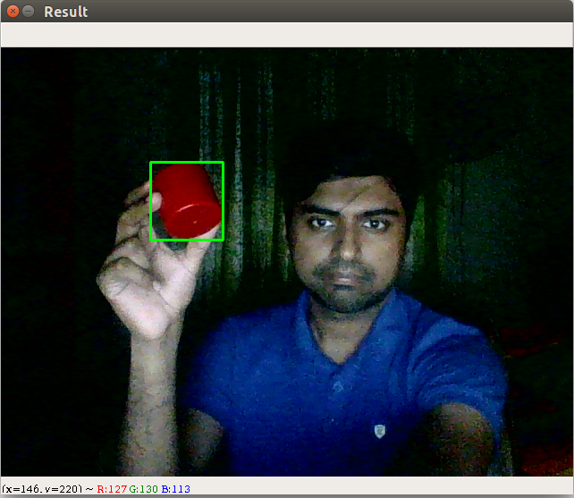
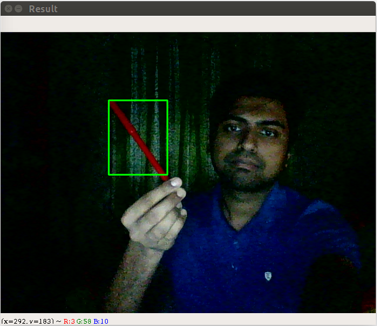

# red_ros
### This is an object detection project for detecting red colored objects through color segmentation using openCV and ROS. The CvBridge Library has been used for Image message conversion between OpenCV and ROS.

## **Brief Description of the python scipts:**

* The publisher node:* reads image data from the webcam and then converts it to ROS interpretable format. Finally the node publishes this image data on a custom topic. 

* The Subscriber node:* Subscribes to the custom topic and reads the ROS image data which is then converted to OpenCV interpretable format. After that, color filtration technique is applied. Finally a contour is drawn on the image around the object in red color.

## **Sample Output**

**Credit: Anis Koubaa**

Link: https://www.youtube.com/watch?v=achgxjqOtiM&list=PLSzYQGCXRW1H8R2Bok_K8wcsE12_49alQ&index=13
